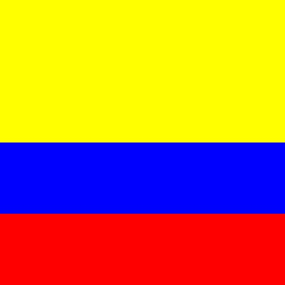

# estructura de un juego en pygame

## inicializacion

- como todo programa en python, se debe importar los modulos o librerias a usar
`import  pygame`

- inicializar pygame usando la funcion init (). inicialza todos los modulos de pygame importados
`pygame.init()`

## visualizacion de la ventana

`ventana = pygama.display.set_mode((600, 400))`

- set.mode() es la funcion encargad de definir el tamaño de ventana. en el ejemplo, se esta definiendo una ventana de 600 px de ancho, por 400 px de alto

`pygame.display.set_caption("mi ventana")`

- set_capcion() esa funcion le da un titulo a la ventana 

### funcion set_mode

`set_mode(size = (0, 0)flags = 0, dpth = 0, display = 0)`

size = (600, 400)
flags:define uno o mas comportamientos de la vantena 
    - valores
        - pygame.FULLSCREEN
        - pygame.resizable
    - ejemplo
        flags = pygame.FULLSCREEN | pygame
    resizable: pantalla completa,dimenciones modificables 

## bucle del juego - game loop 

- bucle infinito que se interrumpira a cumplir siertos criterios

- en cada iteracion del bucle dl juego podemos mover a un personaje, o tener en cuenta que un objeto a alcanzado a otro, o que se ha cruzado la linea de llegada, lo que quiere decir que la paartida a terminado

- cada iteracion es una oportunidad para actualisar todos los datos relacionados con el estado actual de la partida

- en cada interacion se realisa las siguientes tareas:
    1. comprobar que no se alcanzan las condiciones de parada, en cuyo caso se interrumpe el bucle 
    2. actualizar los recursos nesesarios para internacion actual 
    3. obtener las entradas del sistema, o de internacion con el jugador 
    4. actualizartodas todas las entidades que caracterisan el juego
    5. refrescar la pantalla

## superficies pygame

- superficie:
    - elemento gemetrico
    - linea poligono, imagen, texto que se muestra en la pantalla
    - el poligono se puede o no rellenar de color 
    - las superficies se crean de dependiendo del tipo:
        - imagen: image.load()
        - texto: font.render()
        - superficies generica: pygame.surface()
        - ventana del juego: pygamen.display.set_mode()

## ejemplo bandera_colombia

```python

import pygame


amarillo = (255,255,0) 
azul = (0, 0, 255)
rojo = (255, 0, 0)

# inisializamos los modulos de pygame

pygame.init()

# establecer titulo a la ventana 

pygame.display.set_caption("bandera_colombia")

# establecemos las dimenciones de la ventana

ventana = pygame.display.set_mode((400,400))

# definicion del color
color_aleatorio = ()

# crear una superficies

amarillo_superficie = pygame.Surface((400,200))
azul_superficie = pygame.Surface((400,100))
rojo_superficie = pygame.Surface((400,100))

# rellenar la superficie

amarillo_superficie.fill(amarillo)
azul_superficie.fill(azul)
rojo_superficie.fill(rojo)
# inserto o muevo la superficie de la ventana

ventana.blit(amarillo_superficie, (0,0))
ventana.blit(azul_superficie, (0, 200))
ventana.blit(rojo_superficie, (0, 300))

# actualiza la ventana

pygame.display.flip()

# bucle 

while True: 
    event = pygame.event.wait()
    if event.type == pygame.QUIT:
        break

```


## gestion dl tiempo y los eventos

### modulo time

- ofrece variass funciones que permitem conometrar la sesion actual (desde el init) o pausar, la ejecucion, por ejemplo
- funciones
    - pygame.time.get_ticks
    - pygame.time.waitpygame.time.delay

- objeto clock
    - la funcion tick permite actualiza el reloj asociodo con el juego actual
    - se llama cada ves que se utiliza la pantalla del juego
    - permite especificar el numero maximo de fotogramas que se muestra por segundo, y por lo tanto velosidad de ejecucion del juego
    - si insertamos en un bucle de juego la suigiente linea, garantizamos que nunca se ira mas rapido de 50 fotogarmas por segundo: `Clock.tick(50)`

### gestion de eventos

- hay diferentes formas para que el programa sepa que se ha esencdenado un evento 
- es escencial que los programa spuedan conoser inmediatamente las acciones del jugador atraves del teclado, el mouse, joystick o cualquier otro periferico

####  Funcion pygame.event.get

- permite optener todos los eventos en espera de ser prosesados y estan disponibles n una cola
- si n hay ninguno, se obtiene una coleccion vasia
```python
# usamos un bucle FOR para recorrer todos los eventos de la coleccion obtenida al llamar a la funcion GET
for event in pygame.event.get():
    if event.tipe == pygame.KEYDOWN
        if event.key ==  pygame.K_ESCAPE:
            PARAR_JUEGO = True
```
#### Funcion pygame.event.wait

- esta funcion espera a que ocurra  un evento, y en cunto susede esta disponible

```python
while True: 
    event = pygame.event.wait()
    if event.type == pygame.QUIT:
        break
```

#### Funcion pygame.event.poll

- devuelve solo un de los eventos que estan en la cola de espra 

## sonidos en pygame
- pygame.mixer: modulo que permite la qestion del sonido

- music: submodulo  que gestiona la musica de fondo. nesesariamente solo hay uno a la ves 
-Sound: objeto de mixer, que se puede instansiar varias veses para usarlo en los efectos de sonido del juego

### archivo de sonido 

- se recomienda usar dos formatos, principalmente
    - formato WAV(waveform audio file format)
    - formato abierto y gratuito OGG

### Channe (canal) en pygame
- un juego tiene varios canales de sonido
- se puede asignar un sonido an canal 1 y otro diferente al 2
- entonces es pocible reproducir sonido simultaneamente activando la lectura en diferentes canales

## sprites
- objeto que asosia una ubicacion, una representacion grafica(cualquier imagen) y un conjunto de propiedades
- estas propiedades pueden ser un nombre, un texto, valoresbooleanos que caracterizan el objeto en cuestion( por ejemplo si se puede mover o no)
- una posible traduccion del termino sprite poodria ser "imagen-objeto" que se actualiza con cada iteracion del juego
- cuanto mas complejo el juego, mas objetos graficos tiene que gestionar y actualizar lo que puede ser tedioso
- pygame usa no solo la nocion de sprite, sino la nocion  de grupo de sprite (group)
- la nocion de group permite agrupar los objetos del mismo tipo. ejemplo: todos los soldados de un ejercito, lo que se entiende como una coleccion de instancias de una clase Soldado
- un determinado prosesamiento se puede aplicar a un conjunto o subconjunto de sprite. ejemplo: cambiar el color de todos los enemigos o hacer invicibles algunos objetos


